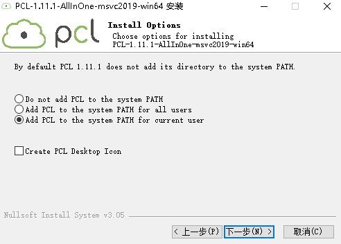

# **rs_driver**  

[中文介绍](README_CN.md) 

## 1 Introduction

**rs_driver** is cross-platform driver kernel for RoboSense LiDAR which is easy for users to do advanced development.

### 1.1 LiDAR type support

- RS16
- RS32
- RSBP
- RS128
- RS80
- RSM1-B3
- RSHELIOS


## 2 Compilation and Installation

**rs_driver** is compatible with the following platforms and compilers: 

- Windows
  - MSVC ( tested with VC2017 and VC2019)
  - Mingw-w64 (tested with x86_64-8.1.0-posix-seh-rt_v6-rev0 )
- Ubuntu (16.04, 18.04)
  - gcc (4.8+)

### 2.1 Install dependencies

**rs_driver** depends on the following third-party libraries. They must be compiled/installed properly in advance:

- Boost 
- pcap
- PCL (optional, only needed if build the visualization tool)
- Eigen3 (optional, only needed if use the internal transformation function)

#### 2.1.1 Install dependencies in Ubuntu

```sh
sudo apt-get install libboost-dev libpcap-dev libpcl-dev libeigen3-dev
```

#### 2.1.2 Install dependencies in Windows

##### Boost

In Windows, Boost needs compiling from source, please refer to the [official guide](https://www.boost.org/doc/libs/1_67_0/more/getting_started/windows.html) for detailed instructions. 

Once finishing installing Boost, add a system environment variable named  ```BOOST_ROOT```  which is set to your Boost path. 

If using MSVC as your compiler, these pre-built [binary installers](https://boost.teeks99.com/) may save you some time.   

##### PCAP

Firstly, install [pcap runtime](https://www.winpcap.org/install/bin/WinPcap_4_1_3.exe).

Then, download pcap's [developer's pack](https://www.winpcap.org/install/bin/WpdPack_4_1_2.zip) to your favorite location and add the path to ```WpdPack_4_1_2/WpdPack``` folder to the ```Path``` environment variable. 

##### PCL

*Note: you can skip installing PCL if you don't want to compile visualization tool.* 

(1) MSVC

Please use the provided official  [All-in-one installer](https://github.com/PointCloudLibrary/pcl/releases).

Select the "Add PCL to the system PATH for xxx" option during installation.



(2) Mingw-w64

Since there'are no installers for mingw-w64 compiler available, PCL needs to be compiled out from source as instructed in this [tutorial](https://pointclouds.org/documentation/tutorials/compiling_pcl_windows.html). 


## 3 Usage

### 3.1 Install in advance

*Note: installation is not supported in Windows.* 

 Install the driver.

```bash
cd rs_driver
mkdir build && cd build
cmake .. && make -j4
sudo make install
```

Then find  **rs_driver** package and link to it in your ```CMakeLists.txt```.

```cmake
find_package(rs_driver REQUIRED)
include_directories(${rs_driver_INCLUDE_DIRS})
target_link_libraries(project ${rs_driver_LIBRARIES})
```

### 3.2 Use rs_driver as a submodule

Add **rs_driver** as your project's submodule, then find **rs_driver** package and link to it in your ```CMakeLists.txt```.

```cmake
add_subdirectory(${PROJECT_SOURCE_DIR}/rs_driver)
find_package(rs_driver REQUIRED)
include_directories(${rs_driver_INCLUDE_DIRS})
target_link_libraries(project ${rs_driver_LIBRARIES})
```


## 4 Quick Start

[Online connect LiDAR](doc/howto/how_to_online_use_driver.md)

[Decode pcap bag](doc/howto/how_to_decode_pcap.md)


## 5 Demo Code & Visualization Tool

### 5.1 Demo Code

**rs_driver** offers two demo programs in ```rs_driver/demo```：

- demo_online.cpp
- demo_pcap.cpp

User can refer to the demo code for usage of api. To build demo programs, set the following option to ```ON``` when configuring using cmake:

```bash
cmake -DCOMPILE_DEMOS=ON ..
```

### 5.2 Visualization Tool

**rs_driver** offer a visualization tool based on PCL in ```rs_driver/tool```：

- rs_driver_viewer.cpp

To build it, set the following option to ```ON``` when configuring using cmake: 

```bash
cmake -DCOMPILE_TOOLS=ON ..
```

For basic usage of this tool, please refer to [Visualization tool guide](doc/howto/how_to_use_rs_driver_viewer.md) 


## 6 Coordinate Transformation

<<<<<<< Updated upstream
 **rs_driver** has the coordinate transformation function built inside and it can output the transformed point cloud directly, which can help users saving extra time to do transformation for point cloud . To enable this function, set the following option to ```ON``` when executing cmake command:
=======
 **rs_driver** has the coordinate transformation function built inside and it can output the transformed point cloud directly, which can save the extra time cost of doing transformation after receiving point clouds from rs_driver. To enable this function, set the following option to ```ON``` when executing cmake command:
>>>>>>> Stashed changes

```bash
cmake -DENABLE_TRANSFORM=ON ..
```

For more details about the tool, please refer to  [Transformation guide](doc/howto/how_to_use_transformation_function.md) 


## 7 Others

Please refer to the following files for more infomation.

- **Parameters definition**: ```rs_driver/src/rs_driver/driver/driver_param.h```
- **Point Cloud message definition**: ```rs_driver/src/rs_driver/msg/point_cloud_msg.h```
- **API definition**: ```rs_driver/src/rs_driver/api/lidar_driver.h```
- **Error code definition**: ```rs_driver/src/rs_driver/common/error_code.h```

Multi-Cast function: [Multi-Cast](doc/howto/how_to_use_multi_cast_function.md) 

