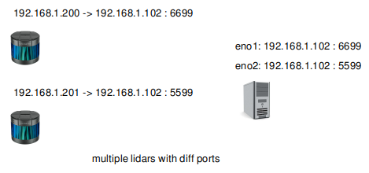
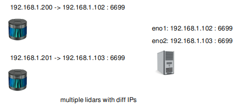

# **8 Online Lidar - Advanced Topics**


## 8.1 Introduction

 The RoboSense LiDAR may work in unicast/multicast/broadcast mode, with VLAN layer and with user layers.

+ This document illustrates how to configure the driver in each case.

   Before configure `rs_driver`, first find out what case the LiDAR is. Please refer to [How to configure rs_driver by PCAP file](./11_how_to_configure_by_pcap_file.md).

+ Even if all configure are correct, some system settings may block `rs_driver` to receive MOSP/DIFOP packets. This document also list them.


## 8.2 Unicast, Multicast and Broadcast

### 8.2.1 Broadcast mode

The simplest way is broadcast mode. 

The LiDAR sends MSOP/DIFOP packets to the host machine (`rs_driver` runs on it). For simplicity, the DIFOP port is ommited here.
+ The LiDAR sends to `255.255.255.255` : `6699`, and the host binds to port `6699`.


Below is how to configure RSDriverParam variable.

```c++
RSDriverParam param;                              ///< Create a parameter object
param.input_type = InputType::ONLINE_LIDAR;       ///< get packet from online lidar
param.input_param.msop_port = 6699;               ///< Set the lidar msop port number, the default is 6699
param.input_param.difop_port = 7788;              ///< Set the lidar difop port number, the default is 7788
param.lidar_type = LidarType::RS32;               ///< Set the lidar type.
```

### 8.2.2 Unicast mode

To reduce the network load, the LiDAR is suggested to work in unicast mode.
+ The LiDAR sends to `192.168.1.102` : `6699`, and the host binds to port `6699`.


Below is how to configure the RSDriverParam variable. In fact, it is same with the broadcast case.

```c++
RSDriverParam param;                              ///< Create a parameter object
param.input_type = InputType::ONLINE_LIDAR;       ///< get packet from online lidar
param.input_param.msop_port = 6699;               ///< Set the lidar msop port number, the default is 6699
param.input_param.difop_port = 7788;              ///< Set the lidar difop port number, the default is 7788
param.lidar_type = LidarType::RS32;               ///< Set the lidar type.
```


### 8.2.3 Multicast mode

The Lidar may also works in multicast mode.
+ The lidar sends to `224.1.1.1`:`6699` 
+ The host binds to port `6699`. And it makes local NIC (Network Interface Card) join the multicast group `224.1.1.1`. The local NIC's IP is `192.168.1.102`.


Below is how to configure the RSDriverParam variable.

```c++
RSDriverParam param;                              ///< Create a parameter object
param.input_type = InputType::ONLINE_LIDAR;       ///< get packet from online lidar
param.input_param.group_address = "224.1.1.1";    ///< Set the multicast group address.
param.input_param.host_address = "192.168.1.102"; ///< Set the host address.
param.input_param.msop_port = 6699;               ///< Set the lidar msop port number, the default is 6699
param.input_param.difop_port = 7788;              ///< Set the lidar difop port number, the default is 7788
param.lidar_type = LidarType::RS32;               ///< Set the lidar type. Make sure this type is correct 
```


## 8.3 Multiple Lidars

### 8.3.1 Different remote ports

If you have two LiDARs, it is suggested to set different remote ports.
+ First LiDAR sends to `192.168.1.102`:`6699`, and the first driver instance binds to `6699`.
+ Second LiDAR sends to `192.168.1.102`:`5599`, and the second driver instance binds to `5599`.



Below is how to configure the RSDriverParam variables.

```c++
RSDriverParam param1;                              ///< Create a parameter object for Lidar 192.168.1.200
param1.input_type = InputType::ONLINE_LIDAR;       ///< get packet from online lidar
param1.input_param.msop_port = 6699;               ///< Set the lidar msop port number
param1.input_param.difop_port = 7788;              ///< Set the lidar difop port number
param1.lidar_type = LidarType::RS32;               ///< Set the lidar type.

RSDriverParam param2;                              ///< Create a parameter object for Lidar 192.168.1.201
param2.input_type = InputType::ONLINE_LIDAR;       ///< get packet from online lidar
param2.input_param.msop_port = 5599;               ///< Set the lidar msop port number
param2.input_param.difop_port = 6688;              ///< Set the lidar difop port number
param2.lidar_type = LidarType::RS32;               ///< Set the lidar type.
```

### 8.3.2 Different remote IPs

An alternate way is to set different remote IPs. 
+ The host has two NICs: `192.168.1.102` and `192.168.1.103`.
+ First LiDAR sends to `192.168.1.102`:`6699`, and the first driver instance binds to `192.168.1.102:6699`.
+ Second LiDAR sends to `192.168.1.103`:`6699`, and the second driver instance binds to `192.168.1.103:6699`.



Below is how to configure the RSDriverParam variables.

```c++
RSDriverParam param1;                              ///< Create a parameter object for Lidar 192.168.1.200
param1.input_type = InputType::ONLINE_LIDAR;       ///< get packet from online lidar
param1.input_param.host_address = "192.168.1.102"; ///< Set the host address.
param1.input_param.msop_port = 6699;               ///< Set the lidar msop port number
param1.input_param.difop_port = 7788;              ///< Set the lidar difop port number
param1.lidar_type = LidarType::RS32;               ///< Set the lidar type.

RSDriverParam param2;                              ///< Create a parameter object for Lidar 192.168.1.201
param2.input_type = InputType::ONLINE_LIDAR;       ///< get packet from online lidar
param2.input_param.host_address = "192.168.1.103"; ///< Set the host address.
param2.input_param.msop_port = 6699;               ///< Set the lidar msop port number
param2.input_param.difop_port = 7788;              ///< Set the lidar difop port number
param2.lidar_type = LidarType::RS32;               ///< Set the lidar type.
```


## 8.4 VLAN

In some user cases, The LiDAR may work on VLAN.  Its packets have a VLAN layer.


`rs_driver cannot parse this packet. Instead, it depends on a virtual NIC to strip the VLAN layer.

Below is an example.
+ The LiDAR works on VLAN `80`. It sends packets to `192.168.1.102` : `6699`. The packet has a VLAN layer.
+ Suppose there is a physical NIC `eno1` on the host.  It receives packets with VLAN layer.


To strip the VLAN layer, create a virtual NIC `eno1.80` on `eno1`, and assign IP `192.168.1.102` to it.

```
sudo apt-get install vlan -y
sudo modprobe 8021q

sudo vconfig add eno1 80
sudo ifconfig eno1.80 192.168.1.102 up
```

Keep `eno1` with IP `0.0.0.0`. At least do NOT set it as same as `eno1.80`. This may block eno1.80.

Now the driver may take `eno1.80` as a general NIC, and receives packets without VLAN layer.

```c++
RSDriverParam param;                              ///< Create a parameter object
param.input_type = InputType::ONLINE_LIDAR;       ///< get packet from online lidar
param.input_param.msop_port = 6699;               ///< Set the lidar msop port number, the default is 6699
param.input_param.difop_port = 7788;              ///< Set the lidar difop port number, the default is 7788
param.lidar_type = LidarType::RS32;               ///< Set the lidar type.
```


## 8.5 User Layer, Tail Layer 

In some user cases, User may add extra layers before or after the MSOP/DIFOP packet.
+ USER_LAYER is before the packet and TAIL_LAYER is after it.


These extra layers are parts of UDP data. The driver can strip them. 

To strip them, just give their lengths in bytes. 

In the following example, USER_LAYER is 8 bytes, and TAIL_LAYER is 4 bytes.

```c++
RSDriverParam param;                              ///< Create a parameter object
param.input_type = InputType::ONLINE_LIDAR;       ///< get packet from online lidar
param.input_param.msop_port = 6699;               ///< Set the lidar msop port number, the default is 6699
param.input_param.difop_port = 7788;              ///< Set the lidar difop port number, the default is 7788
param.input_param.user_layer_bytes = 8;           ///< user layer bytes. there is no user layer if it is 0
param.input_param.tail_layer_bytes = 4;           ///< tail layer bytes. there is no user layer if it is 0
param.lidar_type = LidarType::RS32;               ///< Set the lidar type.
```


## 8.6 System Settings

In below cases, Wireshark can capture MSOP/DIFOP packets, and `rs_driver` is configured correctly, but it can not get MOSP/DIFOP packets. 

+ The LiDAR works on VLAN, but the phisical NIC occupies the destination IP address of the LiDAR.
+ The LiDAR works in broadcast mode, but the host machine have a incorrect netmask, so it takes MSOP/DIFOP packets as unicast and discard them.
+ Firewall blocks MSOP/DIFOP packets.
  
  On ubuntu, use iptables to list the rules
  
  ```
  sudo iptables -L # list all rules
  suod iptalbes --flush # clear all rules
  ```
  
+ Other processes of `rs_driver`, or other programs(such as RSView), have bound the port.


