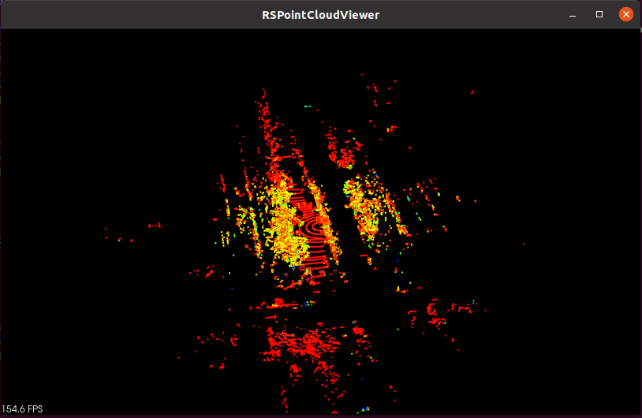

#  **13 如何可视化点云**


## 13.1 概述

`rs_driver_viewer`是`rs_driver`自带的小工具，可以用于显示点云。

本文说明如何使用这个工具。



## 13.2 编译和运行

要编译`rs_driver_viewer`，需要使能编译选项COMPILE_TOOLS=ON。

```bash
cmake -DCOMPILE_TOOS=ON ..
```

运行`rs_driver_viewer`。

```bash
./tool/rs_driver_viewer 
```

### 13.2.1 帮助菜单

- -h

   打印帮助菜单 

- -type

   雷达类型，默认值是*RS16*

- -pcap

   PCAP文件的全路径。如果设置这个参数，则rs_driver_viewer从PCAP文件读取MSOP/DIFOP包，而不是从UDP socket。

- -msop

   接收MSOP包的端口号。默认值是*6699*

- -difop

   接收DIFOP包的端口号，默认值是 *7788*
   
- -group

   主机要加入的组播组的IP地址

- -host

   主机地址

- -x

   坐标转换参数，默认值为0，单位米

- -y

   坐标转换参数，默认值为0，单位米

- -z

   坐标转换参数，默认值为0，单位米

- -roll

   坐标转换参数，默认值为0，单位度

- -pitch

   坐标转换参数，默认值为0，单位米

- -yaw

   坐标转换参数，默认值为0，单位米

注意：**要使用坐标转换功能，需要使能编译选项ENABLE_TRANSFORM=ON.**


## 13.3 使用示例

- 从在线雷达```RS128```接收MSOP/DIFOP包。MSOP端口是```9966```， DIFOP端口是```8877```。

  ```bash
  rs_driver_viewer -type RS128 -msop 9966 -difop 8877 
  ```

- 从PCAP文件解码，雷达类型是```RSHELIOS```。

  ```bash
  rs_driver_viewer -type RSHELIOS -pcap /home/robosense/helios.pcap
  ```

- 从在线雷达```RS16```接收MSOP/DIFOP包。坐标转换参数为x=1.5, y=2, z=0, roll=1.57, pitch=0, yaw=0。

  ```bash
  rs_driver_viewer -type RS16 -x 1.5 -y 2 -roll 1.57 
  ```

  

